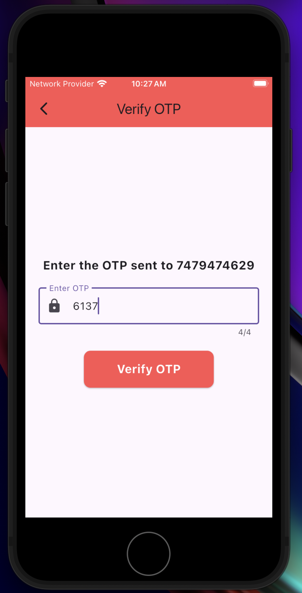
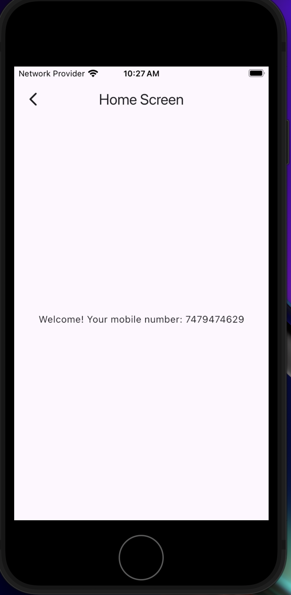

# 🚀 Flutter OTP Authentication System

This project implements an **OTP-based authentication system** using Flutter. It allows users to log in securely by verifying their mobile number through an OTP (One-Time Password).

## 🔹 Features
✅ User enters a mobile number and requests an OTP  
✅ The server generates and sends a unique OTP  
✅ User enters the OTP and submits it for verification  
✅ Upon successful verification, the user is redirected to the **Home Screen**  

## 📸 Screenshots

<table>
  <tr>
    <td><b>🔐 Login Screen</b></td>
    <td><b>🔢 OTP Screen</b></td>
    <td><b>🏠 Home Screen</b></td>
  </tr>
  <tr>
    <td></td>
    <td></td>
    <td></td>
  </tr>
</table>

## 🛠️ Tech Stack
- **Flutter** - UI Development  
- **Dart** - Programming Language  
- **Backend Server** - OTP Generation & Verification  
- **API Integration** - Server Communication  

## 🔗 Getting Started
1. Clone the repository:  
   ```bash
   git clone https://github.com/amit1035/flutter_project.git
